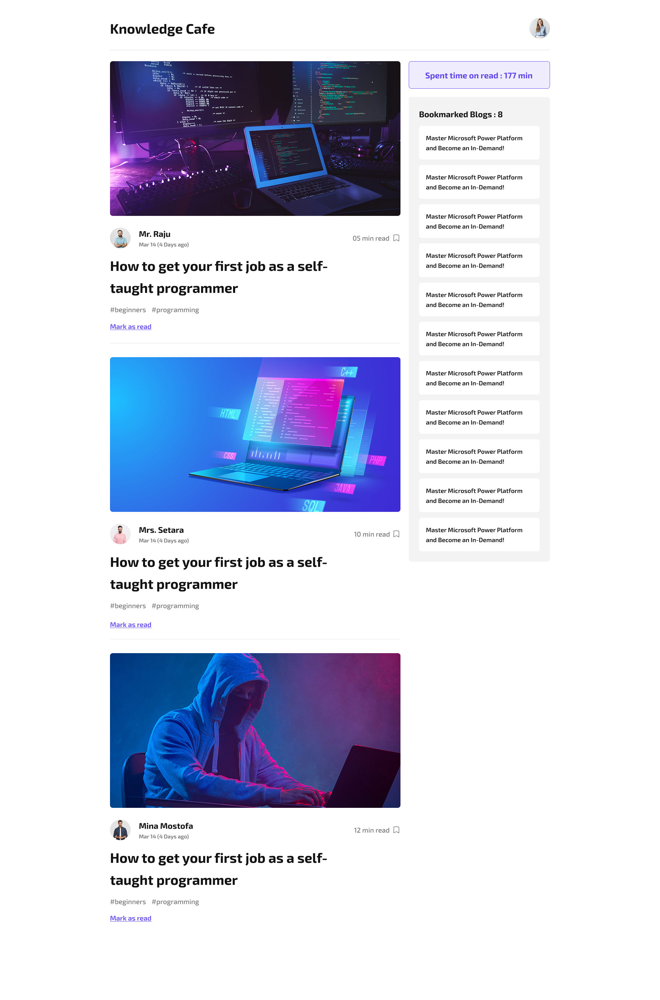

# Knowledge Cafe



Knowledge Cafe is a sophisticated React application that serves as a modern blog reading platform. Built with React 19 and Tailwind CSS, it offers a seamless reading experience with advanced features for content discovery and management.

---
## Features

### Core Functionality
- Dynamic blog feed with real-time updates
- Advanced bookmarking system with persistent storage
- Intelligent reading time tracking and progress monitoring
- Responsive design optimized for all devices
- Rich content display with author profiles and hashtags


### Technical Features
- Modern React hooks and state management
- Component-based architecture for maintainability
- Optimized performance with lazy loading
- PropTypes validation for type safety
- Tailwind CSS for responsive styling

---
## Development Setup

### Prerequisites
- Node.js (v16 or higher)
- npm or yarn package manager

---
### Installation

1. Clone the repository:
```bash
git clone https://github.com/TahmidAhmedKhan/knowledge-cafe.git
```

2. Navigate to project directory:
```bash
cd knowledge-cafe/code-knowledge-cafe
```

3. Install dependencies:
```bash
npm install
# or
yarn install
```

4. Start the development server:
```bash
npm run dev
# or
yarn dev
```

The application will be available at [http://localhost:5173](http://localhost:5173)

### Development Commands

| Command | Description |
|---------|------------|
| `npm run dev` | Start development server |
| `npm run build` | Build for production |
| `npm run lint` | Run ESLint |
| `npm run preview` | Preview production build |

---
## Technical Stack

- React 19 for modern UI development
- Tailwind CSS 4.x for utility-first styling
- Vite for fast development and optimized builds
- PropTypes for runtime type checking
- React Icons for consistent iconography

---
## Project Architecture

### Component Structure
```
src/
├── Components/
│   ├── Blogs/
│   │   ├── Blog/
│   │   │   └── Blog.jsx       # Individual blog post component
│   │   └── Blogs.jsx         # Blog listing and management
│   ├── Bookmarks/
│   │   └── Bookmarks.jsx     # Bookmark management
│   ├── Header/
│   │   └── Header.jsx        # Application header
│   └── ReadingTime/
│       └── ReadingTime.jsx   # Reading time tracker
├── assets/
│   ├── images/              # Image assets
│   └── icons/              # Icon assets
└── App.jsx                 # Main application component
```

---
### Key Features Implementation
- Dynamic blog loading with error handling
- Real-time bookmark management
- Reading time calculation and tracking
- Responsive layout with Tailwind CSS
- Optimized image loading and caching

---
## Contributing

Contributions are welcome! Please open an issue or submit a pull request for any improvements or bug fixes.

---
## License

This project is licensed under the MIT License.

---
**Author:** [Tahmid Ahmed Khan](https://github.com/tahmidak)
